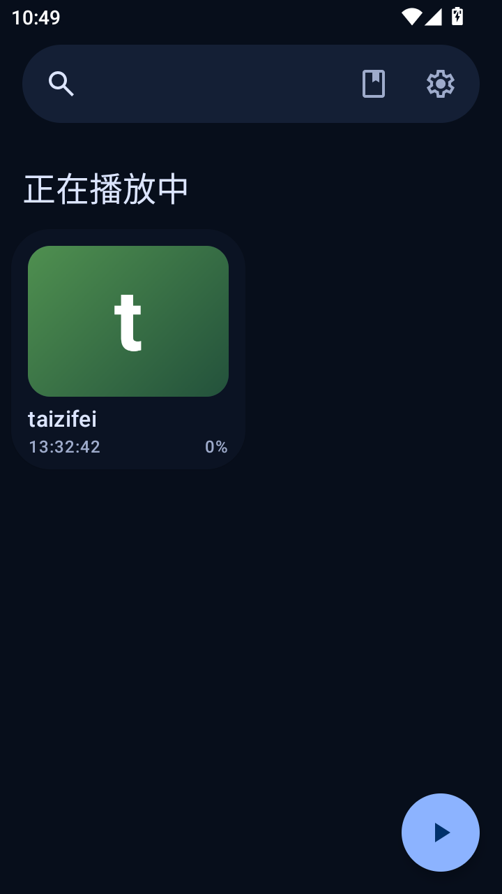

---
hide:
  - toc
---

# Timbre

一款自由开源、本地优先的 Android 有声书播放器。

Timbre 把你自己的有声书文件变成一个安静、顺手的听书库：记住每个位置的播放进度、书签、睡眠定时器、倍速播放、跳过片头片尾、自动封面，全部离线可用。

[:material-download: &nbsp;下载最新版本](https://github.com/cq10086123/Timbre/releases/latest){ .md-button .md-button--primary }
[:material-github: &nbsp;GitHub 仓库](https://github.com/cq10086123/Timbre){ .md-button }

  

## 为什么选择 Timbre？

- :material-shield-check:{ .lg .middle } **本地优先，无广告**

  ---

  不需要账号，没有广告，没有统计与追踪。你的书库只属于你的设备。

- :material-book-open-blank-variant:{ .lg .middle } **为有声书而生**

  ---

  章节导航、断点续播、书签、睡眠定时器、倍速播放，一个不少。

- :material-skip-forward:{ .lg .middle } **跳过片头片尾**

  ---

  每本书独立设置：进集自动跳过开头，播到片尾自动进入下一集。

- :material-image-multiple:{ .lg .middle } **自动封面**

  ---

  文件夹里有图片就自动做封面，多张随机选一张；没有图片也能按书名生成一张。

- :material-cellphone-arrow-down:{ .lg .middle } **应用内更新**

  ---

  启动后后台静默检查新版本，发现更新时弹窗提示，一键前往下载。

- :material-cellphone-link:{ .lg .middle } **Android Auto**

  ---

  支持蓝牙耳机与 Android Auto 的媒体控制，开车也能继续听。

## 它和上游项目的关系

Timbre 基于开源项目 [Voice](https://github.com/PaulWoitaschek/Voice)（GPLv3）二次开发，在全量中文化之外增加了跳过片头片尾、自动封面、应用内更新等功能。详见[关于页](about.md)。
